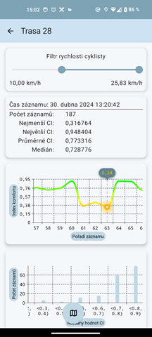

# ComfyBike

Aplikace pro sběr dat a výpočet indexu dynamického komfortu.

Aplikace se dokáže připojit k senzoru Movesense Active pomocí Bluetooth a za jízdy na kole sbírat údaje o vibracích. Na základě nasbíraných dat vytvoří mapu se záznamy indexu dynamického komfortu, což je hodnota, která objektivně reprezentuje kvalitu povrchu pro jízdu na kole.

## Screenshoty

### Hlavní obrazovka

### Detail trasy s mapou

### Export do PNG

